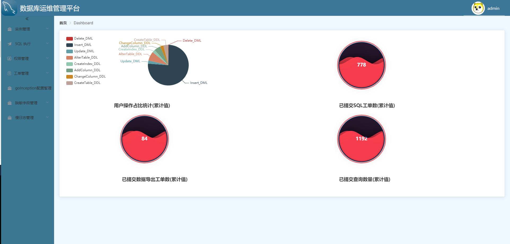
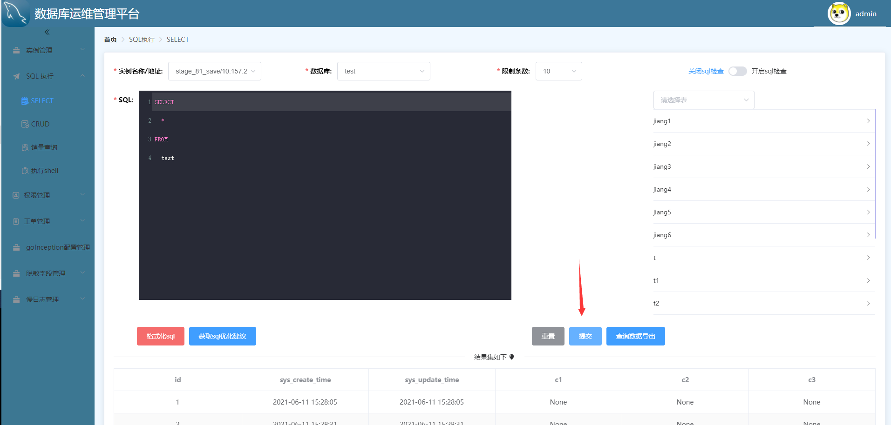
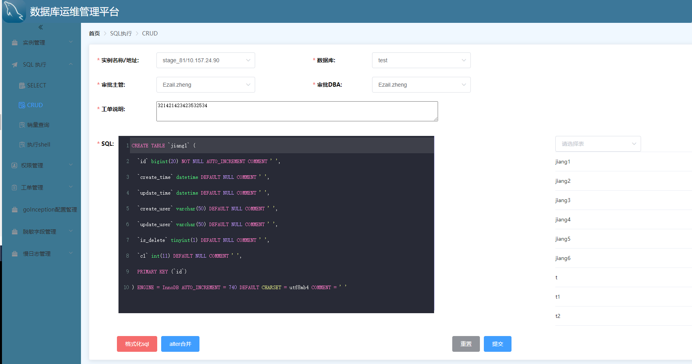
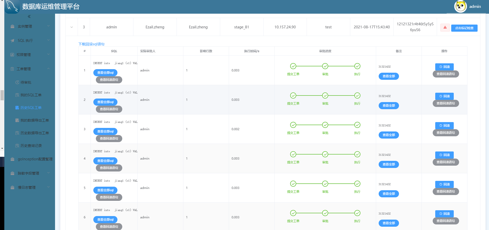
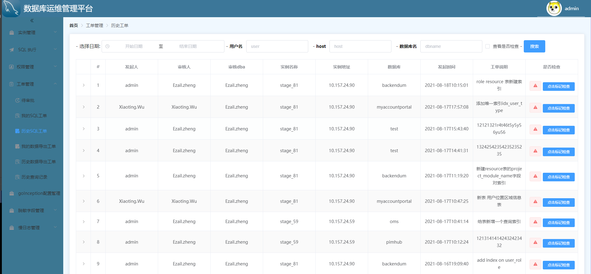
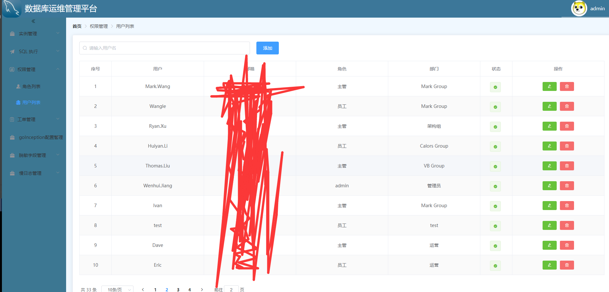

# sql_backend

#### 介绍
数据库运维平台

#### 软件架构
软件架构说明
- **[goInception](https://github.com/hanchuanchuan/goInception)**: hanchuanchuan开源，提供SQL语句审核、执行、回滚功能  
- **[SOAR](https://github.com/XiaoMi/soar)**: 小米开源，提供SQL启发式算法的语句优化、多列索引优化等功能
#### 安装
```
docker run --name goinception -p 4000:4000 -d hanchuanchuan/goinception
docker build -t sql_platform .
docker run --name sql_platform -p 8000:8000 -e PYTHONENV=prod -e mysql_host=xxx -e mysql_port=3306 -e mysql_user=root -e mysql_pwd=123456 -e mysql_db=sql_platform -e inception_host=127.0.0.1 -e inception_port=4000  -d sql_platform
#导入表结构
mysql -uroot -p123456 -D sql_platform < table.sql
```
访问 ip:8000  用户：admin 密码:admin123
## 功能简介

- 目标库管理
    - 支持多场地/数据中心的数据库管理，集群方式归纳目标数据库
    - 支持目标数据库配置，库/表结构查询
- SQL操作
    - 基于goInception
    - SQL语法检测
    - SQL语句执行
    - SQL回滚
    - 定时工单
    - 历史记录
- SQL查询
    - 查询目标数据库的详细表结构
    - 查询表数据，对结果可导出文件
    - SQL语句优化（基于小米SOAR）
- 用户管理
    - 对用户/组的注册/注销/加组/授权等管理
- 个性化设置
    - 管理员可以做SQL关键字拦截，平台的审批功能开关等设置
    - 用户可以订阅其常用的数据库，指定审批工单的经理，以简化审核时所需的操作
- goinception设置
    - goinception服务连接信息
    - goinception备份库连接信息
    - goinception支持的参数释义及值
- 人工审批功能
    - 流程开关
    - 开启流程，工单至少需双人确认（流程：提交人 -- goinception自动审核 -- 经理审批 -- DBA上线）
    - 关闭流程，工单可由经理上线（流程：提交人 -- goinception自动审核 -- 经理上线）
- 用户权限
    - 基于RBAC的表级，对象级权限控制体系
    - 通过用户管理设置用户权限
    - 根据用户身份（组员/主管/）鉴权用户对SQL的审核/取消/执行/回滚等操作
- 操作流程
    - 用户需要输入SQL，指定环境，执行人，数据库
    - goinception自动审核SQL语法
    - 审批人做审批通过或驳回操作
    - 执行人做执行/撤销/回滚等操作
    - SQL列表界面提供SQL查询，操作等相关功能

## 界面展示


- SQL查询

- 工单审核

- 工单详情 1

- 工单详情 2

- 工单列表

- 用户管理


#### 二次开发
这里只面包含了后端的代码，如果需要二次开发前端，下面就提供了前端代码的链接地址 
- [sql平台前端源码](https://gitee.com/jiangwenhui_admin/sql_shop)